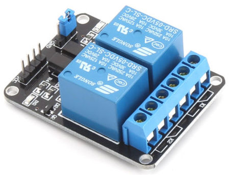
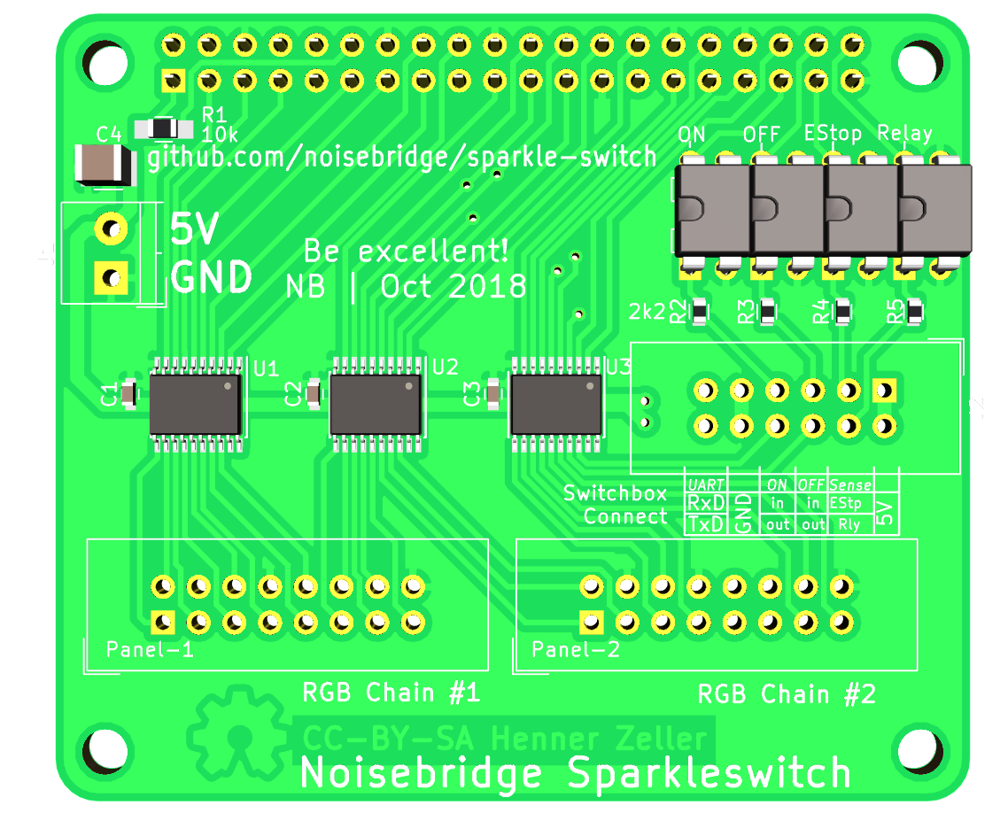
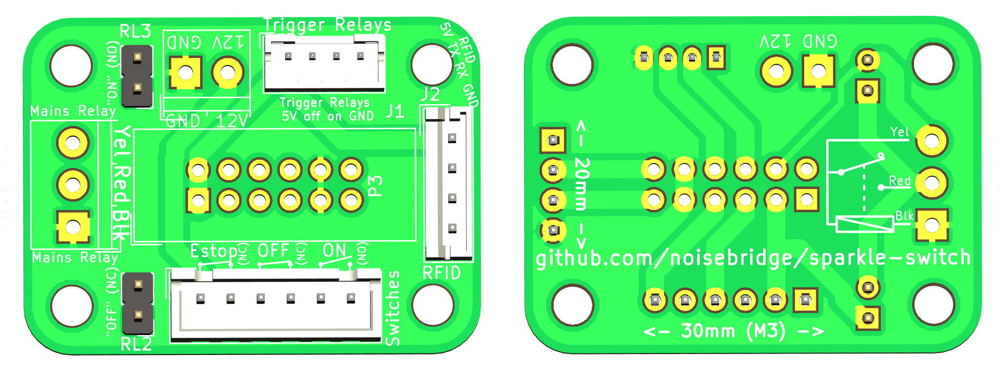

Sparkleswitch
=============

The Noisebridge Laser cutter is an expensive piece of machinery that has
some non-negligible running cost and requires some safety-training before use.

We require to authenticate with an RFID showing previous laser training
in order to switch the laser on. This project contains the relevant electronics
and software to build this switch.

We use a generic EStop/On/Off switch box ([Aliexpress][switch-box-ali], [Amazon][switch-box-amazon]) as basic user interface, coupled with an
additional [RFID reader].

## Requirements

 * Have a switch that provides on/off and emergency off buttons as well
   as an RFID reader.
 * The safety relevant triggering of the emergency button **must**
   shut off power reliably by simple electromechanical means with no software
   involved to work even if the computer has issues.
   After an Emergency-Off, it is required to reset the EStop button
   (manual twisting) _and_ re-activating via RFID.
 * Have a display to show the currently active user, potentially laser
   time accounting, uplifting idle-animations etc.
 * It is common to pass the custody of the running laser cutter to the next
   user, so make it simple to switch the active user without power-cycling
   the laser.
 * Connection between Pi and emergency off button is separate, so it should
   be simple to wire up.

## Design considerations

As controlling computer, we use a Raspberry Pi: it is cheap, [can run
a LED display][rpi-rgb-matrix], and has enough additional GPIO pins to
read button state and trigger relays.

Since we need to switch line voltage with the Pi, we use a relay.
The basic switch mechanism is a simple relay circuit acting as a Set/Reset
Flip-Flop that fails safe on power loss.
Two control relays for set/reset are triggered by the Raspberry Pi; the main
switching 4-pole relay is part of the flip-flop and also switching the
mains phases for the machine.

The mains relay uses one of its poles to act as self-sustaining relay.
A momentary switch of the 'on' trigger relay will switch on the machine,
and a momentary interrupt from the 'off' trigger will switch off the machine:

The Emergency-Off button is cutting power to the relay circuit, thus acting
as master reset (thereby meeting the no-software-involved safety requirements).
Set (= switch power on) and Reset (= switch power off) are triggered by the
Raspberry Pi.

Inputs and outputs are

 * `in` **Emergency Off** button. Directly wired in the
    circuit acting as physical 'reset' for the SR-FlipFlop. Also wired to a
    GPIO as input to inform the application about the state.
 * `in` **On** button. Wired to a GPIO input as a soft-button for
    the application.
 * `in` **Off** button. Wired to a GPIO input as a soft-button for the
    application.
 * `in` a sense input to detect if the mains-relay coil voltage is on. Mostly
    for fault detection via software.
 * `out` **Trigger on** relay. Controlled by GPIO
    to trigger *set* of SR-FlipFlop.
 * `out` **Trigger off** relay. Controlled by GPIO
    to trigger *reset* of SR-FlipFlop.
 * `serial in/out` **RFID** reader (connected to UART on Pi).

Since we use the on/off buttons to interact with the application as
soft-buttons (e.g. to trigger 'pending off'), they are not physically wired
into the circuit but used as input to the computer (this is fine as they
are not in the safety critical path).

There is a little space in the switch box which will house the trigger relays
and possibly the RFID reader. The relay switching of the line voltage for the
laser cutter is mounted near the outlet for the machine, connected with three
wires (see above:`GND`, `Sustain`, `Trigger ON`) remotely from the switch box.

As trigger relays, we use off-the-shelf and [cheap][ebay-search-dual-relay]
relays.

## State machine

The software on the Pi implements the following state machine; it uses inputs
and outputs mentioned above.
Inputs are on the transition edges; external actions triggered by the
application are represented as hexagons. Since we often have the situation
that we want to pass the running laser to the next user without having to
switch it entirely off and on again, there is a provision to change the user
while the machine is running:

## Components

There are three physical parts to the system:

  1. RGB LED matrix screen, that has a Raspberry Pi connected to it to
     display the user interface.
  2. The switch box is separate from that and mounted under the display.
  3. The mains relay that is close to the outlet of the
     laser-cutter, and remotely controlled with a 12V control voltage.

The connection between the switch-box and the Pi is a simple flat cable with
an [IDC-12 connector] on both ends.

| Desc               | Pin | Pin | Desc
|-------------------:|:---:|:---:|:-----------------------------
|               +5V  |   1 |   2 | +5V (low current; for trigger relays and RFID)
|   Sense EStop `in` |   3 |   4 | `in` sense relay voltage (e.g. for failure detection)
|    Off-Button `in` |   5 |   6 | `out` Relay Trigger Off
|     On-Button `in` |   7 |   8 | `out` Relay Trigger On
|               GND  |   9 |  10 | GND
|     UART RX on Pi  |  11 |  12 | UART TX on Pi (3.3V TTL)

There is a PCB on the Raspberry Pi to wire up the LED panels and provide the
connector to the switch-box, and a PCB in the switch-box as a breakout board.

### Pi Sparkle HAT

The Rasbperry Pi connects to the [Pi Sparkle HAT](./hardware/pi-hat), that
provides connections for two chains of HUB75 RGB LED matrix
(using the [rpi-rgb-matrix] project) and the
Sparkleswitch-specific IDC-12 connector to connect to the switch box.

Inputs (from switches and sense-lines all operating at 12V) are insulated with
opto couplers. The relay trigger outputs are 5V TTL
(but non-insulated as the receiving end uses opto-couplers already).

### Switch Box

A [small breakout board in the switch-box](./hardware/switch-connector)
provides a way to connect the switches, the Trigger-Relays (housed inside the
switch-box) and the RFID reader (attached to switch box). It also provides a
screw terminal to wire up to the mains-relay whose wires are also terminating
in the switch box.

[switch-box-ali]: https://www.aliexpress.com/wholesale?SearchText=NC+Emergency+Stop+Red+Green
[switch-box-amazon]: https://www.amazon.com/gp/product/B0097B4YK0
[rpi-rgb-matrix]: https://github.com/hzeller/rpi-rgb-led-matrix
[RFID reader]: https://github.com/noisebridge/rfid-access-control/tree/master/hardware/terminal
[IDC-12 Connector]: https://www.google.com/images?q=idc-12+connector
[ebay-search-dual-relay]: https://www.ebay.com/sch/i.html?_nkw=%222+channel%22+relay+arduino&_sop=15
