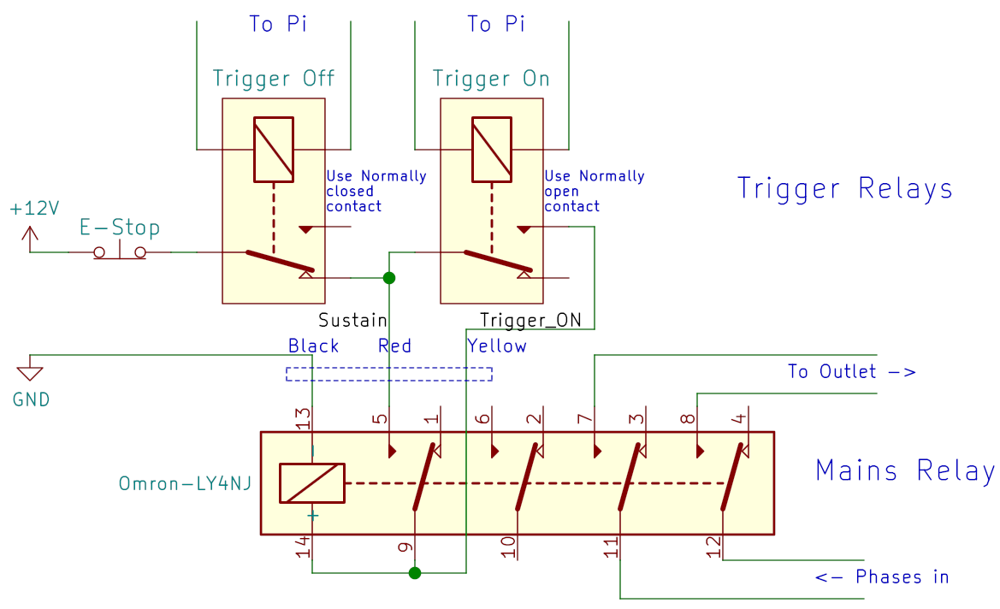

Sparkleswitch
=============

The Noisebridge Laser cutter is an expensive piece of machinery that has
some non-negligible running cost and requires some safety-training before use.

We require to authenticate with an RFID showing previous laser training
in order to switch the laser on. This project contains the relevant electronics
and software to build this switch.

We use a [generic EStop/Off/On switch box][switch-box] as basic user interface,
coupled with an additional [RFID reader].

# Requirements

 * The safety relevant triggering of the emergency button must
   shut off power reliably by simple electromechanical means with no software
   involved to work even if the computer has issues.
   After an Emergency-Off, it is required to reset the EStop button
   (manual twisting) _and_ re-activating via RFID.
 * Have a switch that provides on/off and emergency off buttons as well
   as an RFID reader.
 * Have a display to show the currently active user, potentially laser
   time accounting etc.
 * It is common to pass the custody of the running laser cutter to the next
   user, so make it simple to switch the active user without power-cycling
   the laser.
 * Connection between Pi and emergency off button is separate, so it should
   be simple to wire up.

# Design considerations

As controlling computer, we use a Raspberry Pi: it is cheap, [can run
a LED display][rpi-rgb-matrix], and has enough additional GPIO pins to
read button state and trigger relays.

Since we need to switch line voltage with the Pi, we use a relay.
The basic switch mechanism is a simple relay circuit acting as a Set/Reset
Flip-Flop that fails safe on power loss.
Two control relays for set/reset are triggered by the Raspberry Pi; the main
switching 4-pole relay is part of the flip-flop and also switching the
mains phases for the machine:

The Emergency-Off button is cutting power to the relay circuit, thus acting
as master reset (thereby meeting the no-software-involved safety requirements).
Set (= switch power on) and Reset (= switch power off) are triggered by the
Raspberry Pi.

Inputs and outputs are

 * `in` **Emergency Off** button. Directly wired in the
    circuit acting as 'reset' for the SR-FlipFlop. Also wired to a GPIO
    as input to inform the application.
 * `in` **On** button. Wired to a GPIO input.
 * `in` **Off** button. Wired to a GPIO input.
 * `in` **RFID** reader (connected to UART on Pi).
 * `out` **Trigger on** relay. Controlled by GPIO to trigger *set* of SR-FlipFlop.
 * `out` **Trigger off** relay. Controlled by GPIO to trigger *reset* of SR-FlipFlop.

Since we use the on/off buttons to interact with the application as
soft-buttons (e.g. to trigger 'pending off'), they are not physically wired
into the circuit but used as input to the computer (this is fine as they
are not in the safety critical path).

There is a little space in the switch box which will house the trigger relays
and possibly the RFID reader. The relay switching of the line voltage for the
laser cutter is mounted near the outlet for the machine.

## State machine

The state machine uses the inputs and outputs mentioned above. Inputs are
on the transition edges; external actions triggered by the application
are represented as hexagons.

## Connection

The connection between the switch-box and the Pi (which is mounted behind the
LED display) is a simple flat cable with an IDC connector on both ends.
Opto-couplers on the Raspberry Pi-end are used to make the inputs of
the Pi 12V tolerant (as all inputs are 12V levels).

The outputs are OpenCollector outputs from the Pi (again, done with
Opto-couplers), which allow to use the triggers to operate 5V or 12V logic
if needed (up to 5mA).

A TTL serial connection is provided for the RFID reader also residing in/near
the switch box (undecided yet if these should also be opto-decoupled).

The switch box needs to get a separate 12V supply to power the relays (and via
a DC/DC converter, the RFID reader?)

The wiring between the IDC connector and switches/relays/RFID reader are
done with a little PCB residing in the switch box.

## Pi HAT

(TBD) - a combination of a simple rpi-rgb-led-matrix wiring + opto-decoupled
outputs.

[switch-box]: https://www.amazon.com/gp/product/B0097B4YK0
[rpi-rgb-matrix]: https://github.com/hzeller/rpi-rgb-led-matrix
[RFID reader]: https://github.com/noisebridge/rfid-access-control/tree/master/hardware/terminal