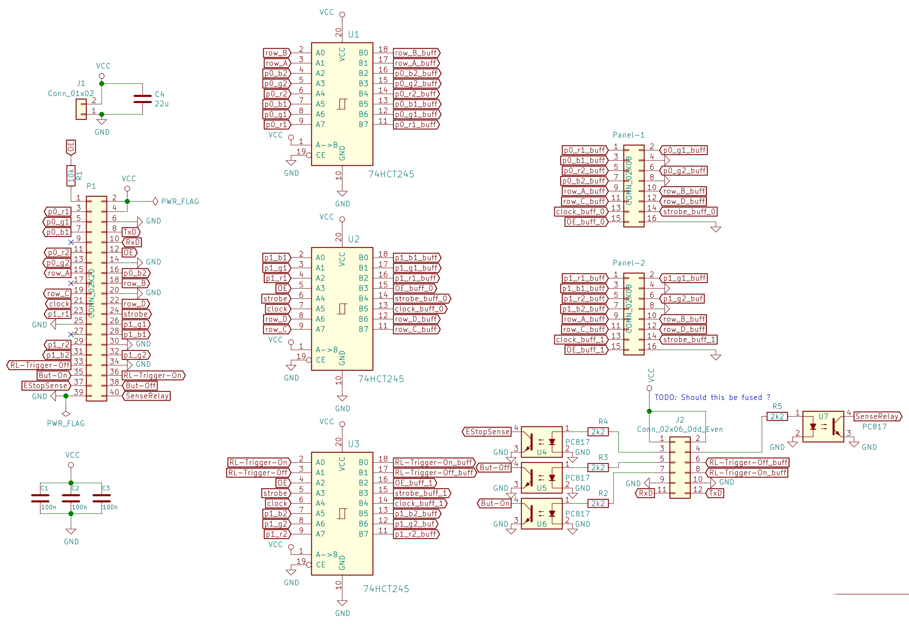

Pi Sparkle HAT
==============

The Sparkle HAT connects to Raspberry Pi GPIOs, does 3.3V->5V level shifting
to connect to HUB75 LED matrixes (to be controlled with the [rpi-rgb-matrix]
code), and the Sparkleswitch-specific IDC-12 connector to connect to the
switch box.

The level shifters are needed as the LED matrixes need 5V logic level. We also
use two free drivers to provide 5V TTL level for the trigger relay outputs
on the IDC-12 connector.

Inputs (from switches and sense-lines all operating at 12V) are insulated with
PC817 opto couplers. The relay trigger outputs are non-insulated as the
receiving end uses opto-couplers already.

To provide strong mechanical support, the HAT is full size with all four
mounting holes.

[rpi-rgb-matrix]: https://github.com/hzeller/rpi-rgb-led-matrix