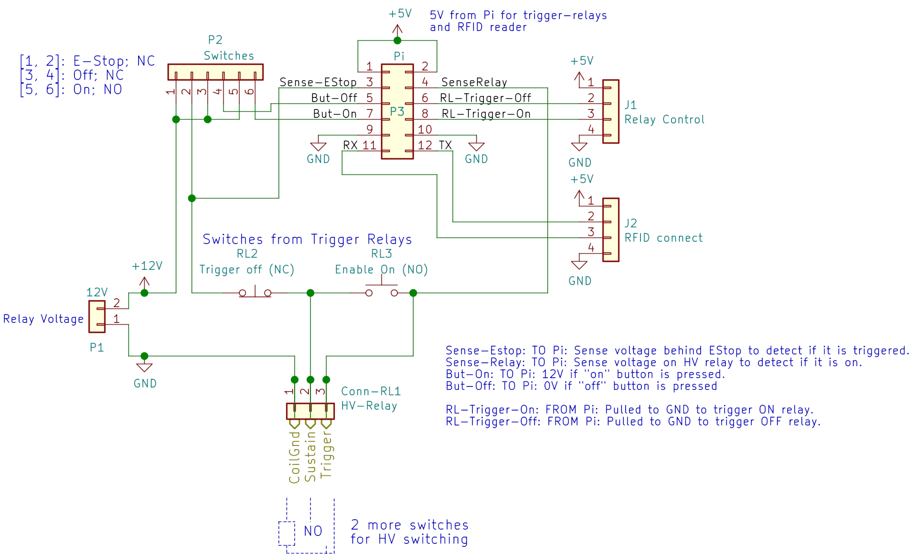

Switch Connector
================

Inside the switch box, there needs to be some simple wiring that connects
the switches to the IDC-12 connector towards the Pi, provides a screw-terminal
for the large mains-relay and internal connections to wire up a standard
low-voltage relay. To simplify that and improve maintainability, this is a
small PCB inside the switch box.

The connector to the switches is an JST-XH connector, which can be cheaply
acquired pre-crimped, as they are also used as battery charge balance
connectors.

| Desc               | Pin | Pin | Desc
|-------------------:|:---:|:---:|:-----------------------------
|               +5V  |   1 |   2 | +5V (low current; for trigger relays and RFID)
|   Sense EStop `in` |   3 |   4 | `in` sense relay voltage (e.g. for failure detection)
|    Off-Button `in` |   5 |   6 | `~out` Relay Trigger Off (Open collector, 5mA)
|     On-Button `in` |   7 |   8 | `~out` Relay Trigger On (Open collector, 5mA)
|               GND  |   9 |  10 | GND
|     UART RX on Pi  |  11 |  12 | UART TX on Pi (3.3V TTL)

